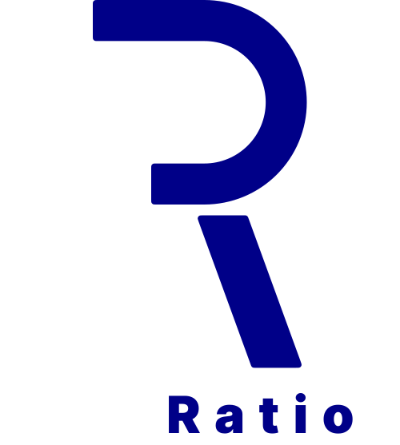

[](https://wakatime.com/badge/user/0f362d83-3d86-4cdb-b58d-28ad23922737/project/76b52458-4d89-42cb-a388-8db5de13302b)
# Incratio

The first goal is to kwnow the different tools that can I will use to create the project. This include:

- Understeamd the different frameworks tools
- List all the site with beautifull GUI

## Tools
  - [Bento](https://bentojs.dev/) //use by google
  - [Tailwind](https://tailwindcss.com/)
  - [Framer](https://framer.com/)

## Sites with grate UI

- [Laravel](https://laravel.com/)
- [Dropbox](https://www.dropbox.com/)
- [Bootstrap](https://getbootstrap.com/)
- [Tailwind](https://tailwindcss.com/)
- [Figma](https://www.figma.com/)
- [Framer](https://framer.com/)
- [TradingView](https://www.tradingview.com/)
- [PortfolioVisualizer](https://www.portfoliovisualizer.com)
- [rolling](https://marketlab.pages.dev)

## logo

1. Scelta del Font
Font per 'INC': Il font attuale è pulito e professionale, il che è adatto per il contesto finanziario. Tuttavia, potresti considerare un font leggermente più moderno e geometrico per dare un tocco di innovazione.
Font per 'RATIO': Il font in blu funziona bene, ma potrebbe essere utile sperimentare con una versione in grassetto per enfatizzare ulteriormente la parola e bilanciare meglio il logo.
2. Palette di Colori
Nero per 'INC': Il colore nero trasmette serietà e professionalità, quindi è una buona scelta. Potresti considerare un grigio scuro per un aspetto leggermente più morbido.
Blu per 'RATIO': Il blu è eccellente per trasmettere fiducia e sicurezza. Valuta una sfumatura più scura per un aspetto ancora più autorevole.
3. Icona o Simbolo
Aggiunta di un'Icona: Considera l'aggiunta di un'icona che rappresenti la crescita o l'analisi statistica. Un grafico a barre o un grafico a linee potrebbe funzionare bene per rappresentare visivamente il concetto di crescita e analisi finanziaria.
4. Layout
Allineamento: L'allineamento attuale è pulito, ma puoi sperimentare con un layout impilato (dove 'INC' è sopra 'RATIO') per vedere se migliora la leggibilità e l'impatto visivo.
Spaziatura: Assicurati che ci sia sufficiente spaziatura tra le lettere per evitare un aspetto troppo affollato, specialmente se utilizzi un font in grassetto per 'RATIO'.
5. Considerazioni Generali
Semplicità: Mantieni il design semplice e professionale. Troppi elementi possono distrarre dal messaggio principale.
Coerenza: Assicurati che tutti gli elementi del logo siano coerenti con il messaggio di affidabilità e professionalità che vuoi trasmettere.
Spero che questi suggerimenti ti siano utili per migliorare ulteriormente il tuo logo!


  

  

  

# Color

#1A3EAD
#0c1db5
#303f7b
#0e65a7
#172483
#1D67D1
#000088 (Deutsche Bank)


## Some possible names

**`Short and Memorable:`**

- DeltaAssets

- AssetDelta

- IncRatio

- AssetInc

- RatioPlus

**`Descriptive and Informative:`**

- IncrementalAssetCalculator
- AssetRatioAnalysis
- GrowthRateFinance
- AssetEfficiencyTracker
- DeltaAssetGrowth

**`Creative and Catchy:`**

- AssetUp
- RatioRise
- GrowthGauge
- DeltaFinance
- AssetAccel


<a alt="Nx logo" href="https://nx.dev" target="_blank" rel="noreferrer"></a>

✨ Your new, shiny [Nx workspace](https://nx.dev) is almost ready ✨.

[Learn more about this workspace setup and its capabilities](https://nx.dev/getting-started/tutorials/react-monorepo-tutorial?utm_source=nx_project&amp;utm_medium=readme&amp;utm_campaign=nx_projects) or run `npx nx graph` to visually explore what was created. Now, let's get you up to speed!

## Finish your CI setup

[Click here to finish setting up your workspace!](https://cloud.nx.app/connect/8w2bpaCXHH)


## Run tasks

To run the dev server for your app, use:

```sh
npx nx serve frontend
```

To create a production bundle:

```sh
npx nx build frontend
```

To see all available targets to run for a project, run:

```sh
npx nx show project frontend
```

These targets are either [inferred automatically](https://nx.dev/concepts/inferred-tasks?utm_source=nx_project&utm_medium=readme&utm_campaign=nx_projects) or defined in the `project.json` or `package.json` files.

[More about running tasks in the docs &raquo;](https://nx.dev/features/run-tasks?utm_source=nx_project&utm_medium=readme&utm_campaign=nx_projects)

## Add new projects

While you could add new projects to your workspace manually, you might want to leverage [Nx plugins](https://nx.dev/concepts/nx-plugins?utm_source=nx_project&utm_medium=readme&utm_campaign=nx_projects) and their [code generation](https://nx.dev/features/generate-code?utm_source=nx_project&utm_medium=readme&utm_campaign=nx_projects) feature.

Use the plugin's generator to create new projects.

To generate a new application, use:

```sh
npx nx g @nx/react:app demo
```

To generate a new library, use:

```sh
npx nx g @nx/react:lib mylib
```

You can use `npx nx list` to get a list of installed plugins. Then, run `npx nx list <plugin-name>` to learn about more specific capabilities of a particular plugin. Alternatively, [install Nx Console](https://nx.dev/getting-started/editor-setup?utm_source=nx_project&utm_medium=readme&utm_campaign=nx_projects) to browse plugins and generators in your IDE.

[Learn more about Nx plugins &raquo;](https://nx.dev/concepts/nx-plugins?utm_source=nx_project&utm_medium=readme&utm_campaign=nx_projects) | [Browse the plugin registry &raquo;](https://nx.dev/plugin-registry?utm_source=nx_project&utm_medium=readme&utm_campaign=nx_projects)


[Learn more about Nx on CI](https://nx.dev/ci/intro/ci-with-nx#ready-get-started-with-your-provider?utm_source=nx_project&utm_medium=readme&utm_campaign=nx_projects)

## Install Nx Console

Nx Console is an editor extension that enriches your developer experience. It lets you run tasks, generate code, and improves code autocompletion in your IDE. It is available for VSCode and IntelliJ.

[Install Nx Console &raquo;](https://nx.dev/getting-started/editor-setup?utm_source=nx_project&utm_medium=readme&utm_campaign=nx_projects)

## Useful links

Learn more:

- [Learn more about this workspace setup](https://nx.dev/getting-started/tutorials/react-monorepo-tutorial?utm_source=nx_project&amp;utm_medium=readme&amp;utm_campaign=nx_projects)
- [Learn about Nx on CI](https://nx.dev/ci/intro/ci-with-nx?utm_source=nx_project&utm_medium=readme&utm_campaign=nx_projects)
- [Releasing Packages with Nx release](https://nx.dev/features/manage-releases?utm_source=nx_project&utm_medium=readme&utm_campaign=nx_projects)
- [What are Nx plugins?](https://nx.dev/concepts/nx-plugins?utm_source=nx_project&utm_medium=readme&utm_campaign=nx_projects)

And join the Nx community:
- [Discord](https://go.nx.dev/community)
- [Follow us on X](https://twitter.com/nxdevtools) or [LinkedIn](https://www.linkedin.com/company/nrwl)
- [Our Youtube channel](https://www.youtube.com/@nxdevtools)
- [Our blog](https://nx.dev/blog?utm_source=nx_project&utm_medium=readme&utm_campaign=nx_projects)
